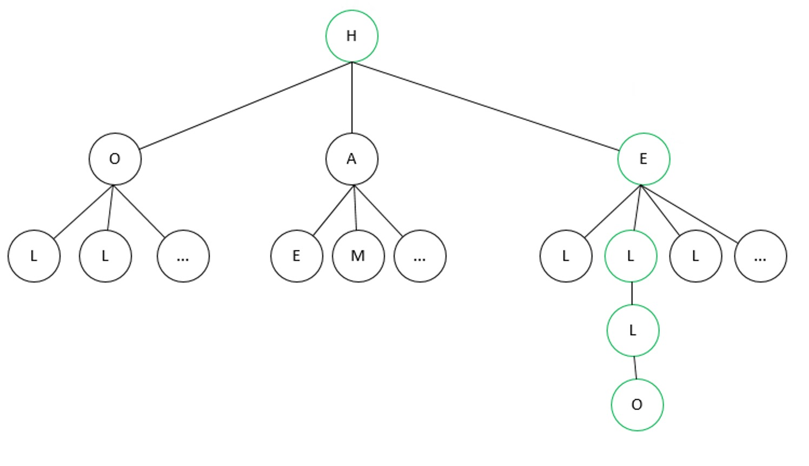

# WordBlitzCheater
## Intro
Do you know the [WordBlitz Game](https://wordblitz.com/) ?, It is a free game, and it's a battle of three rounds of 1 mn each where you need to find the maximum of words. It's really a good game, and with my son we love playing it. One day, my son asked me, if I can you hack the game ? At least I can try...

## The Plan
Starting from the supposition the application relies on web services, my idea is to intercept the requests sent by the application. Then, If we can programmatically, get the grid content, find the bests words and send theses words to the server then we are done. . So, is the plan step by step:
* Intercept Requests
* Analyses the request, get the grid, find words, send the words to the server.
* Write a robot to play automatically.

## Intercept
The game runs on mobile phone, ans what we want is to get the requests on a laptop. In other words, we want to lead a (Man in the middle attack)[https://en.wikipedia.org/wiki/Man-in-the-middle_attack]. 
The best tool for this is [Burp tool](https://portswigger.net/burp).  The most important difficulty with MoM attack is to bypass the certificate protection. Indeed, when the proxy intercepts a request, it uses is own certificate to dialog with the server. The the browser can detect that someone is listening on the channel, since the certificate was fuzzed. We can by-pass the protection, by trusting the certificate coming from the Burp tool, it means that Burp will use is own certificate to sign the answer, and as the certificate is trusted, the browser will accept the answer. 
To trust the certificate we can configure it as described in the portswigger [documentation:](https://portswigger.net/burp/documentation/desktop/mobile/config-ios-device). 
To sum up:
* Start Burp proxy on a Computer.
* Trust the Burp certificate on mobile phone.
* Configure the proxy client on the mobile and make it point out on the Burp proxy.

## Request analysis
After the proxy configured on the mobile, and the burp proxy running on the computer, we get all requests coming in and out from the mobile. So we can start a game with wordblitz to analyze what is behind the scene.
We got the following result:

What a bunch o requests! After sorting them, three are quite intersting:
* *v2/game/list* returns all the games
* *v2/game/start* starts a round
* *v2/game/play* closes a round

#### Analysing more deeper the *v2/game/list*, I discovered the request is really juicy !
* First, when a new game is created, the game contains already the three rounds, meaning we have all grids in advanced. 
* Moreover, we have all available words in advance ! 

#### The *v2/game/start* request, just starts a game with the the round id and a timer.

#### And finally the request *v2/game/play* sends all path found in json form with an url encoding: 
 

## Writing a Robot to automate the game play.
Before exploiting the program, we can get the signature parameter provided as url parameter for each request. 
 
This parameters authenticates our user on the server. If we reuse this parameter, we can run the requests on any device, it means we can run a robot from a laptop 
As I have already the grid, and all words, as first step I wrote a first script to display the grid for the current round and return all words.
 
But we can do better. We want to find words with the best score, and automate a game play. 
We know we have to find the path of the words in the grid. 
To solve this I represented the grid as a [graph](https://en.wikipedia.org/wiki/Graph_theory) 
Supposing we have the following grid and we search for the *Hello* word.
  
We created a node for each letters and link each letter to the ones next to it. Finally to find a word in the grid means find a path in the graph.
  

After, we can display the grid, find path of the word in the grid and computes the score, and eventually sort by the best words.

Finally, we can complete the program to make it playing automatically as we already have the path in the grid, just send the request with it. To be more discret I added an option to decide how many words will be returned!
 

 

  Enjoy ;)

## Conclusion
Cheating is bad... :)  Beyond the hack of the game, now I am able to see all data and personal data leaking out of my mobile - "If it is free you are the product !".

## Make the program working
Install:

    $ pip3.10 install -r requirements.txt
    
You need to retrieve the signature, for exmple using burp and paste-it in the config.json file.

    $ python3.10 main
    

